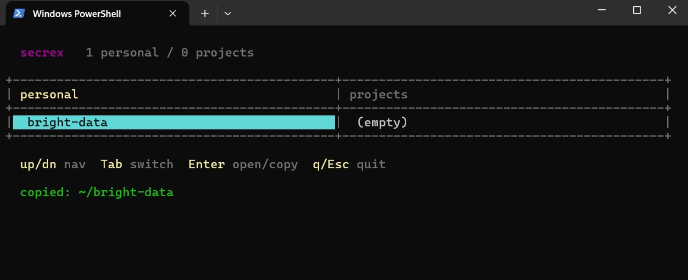

# secrex



A small per-user secret manager for PowerShell. Secrets are stored in a single JSON file under `%APPDATA%\secrex\`, with values encrypted via Windows DPAPI (`ConvertFrom-SecureString` / `ConvertTo-SecureString`). No external dependencies. Works on Windows PowerShell 5.1 and PowerShell 7+.

- **Scopes:** personal (`~`) and per-project (folder-based)
- **One-file module:** `secrex.psm1` + `secrex.psd1`
- **CLI aliases:** `g`, `s`, `a`, `ls`, `rm`, `i`
- **TUI:** running `secrex` with no arguments opens an interactive two-pane view
- **Wildcards in `get`:** `secrex g 'bri*'`, `secrex g 'myapp/*'`, `secrex g '/token'`
- **DPAPI-bound:** the store only decrypts for the Windows user who wrote it

## Install

```powershell
git clone https://github.com/<you>/secrex.git D:\Tools\secrex
Import-Module D:\Tools\secrex\secrex.psd1
```

To have it available in every PowerShell session, append the import line to your `$PROFILE`:

```powershell
if (-not (Test-Path $PROFILE)) { New-Item -ItemType File -Path $PROFILE -Force | Out-Null }
Add-Content -Path $PROFILE -Value "`nImport-Module D:\Tools\secrex\secrex.psd1"
```

> Windows PowerShell 5.1 and PowerShell 7 use **different** `$PROFILE` paths. Run the snippet in each host you care about.

If PowerShell refuses to run the profile (`running scripts is disabled`), unblock user-scope scripts once:

```powershell
Set-ExecutionPolicy -Scope CurrentUser RemoteSigned
```

## Quick start

```powershell
# register the current folder as a project (project name = folder name)
cd D:\Tools\myapp
secrex init

# add secrets
secrex add openai                 # personal, interactive hidden prompt
secrex add myapp/github           # project-scoped, interactive
secrex add bright-data 1d045222   # inline value (goes into PS history)

# read secrets
secrex get openai                 # prints the value
secrex g  myapp/github -Copy      # copies to clipboard
$s = secrex g myapp/github -AsSecureString

# list
secrex ls                         # every secret
secrex ls ~                       # only personal
secrex ls projects                # registered projects + folder paths
secrex ls myapp                   # everything in project myapp
secrex ls /openai                 # all secrets named 'openai' across scopes

# delete
secrex rm myapp/github
```

## Commands

| Command   | Aliases         | What it does                                  |
| --------- | --------------- | ---------------------------------------------- |
| `init`    | `i`             | register current folder as a project           |
| `set`     | `s`, `add`, `a` | store a secret (prompts if value omitted)      |
| `get`     | `g`             | read a secret; supports wildcards               |
| `list`    | `ls`            | list secrets, filtered                          |
| `remove`  | `rm`            | delete a secret                                 |
| `help`    | `-h`, `--help`  | show command reference                          |

## Path grammar

Secrets live at `<scope>/<name>`. `~` is the personal scope; anything else is a project name registered via `secrex init`.

| Path              | Meaning                                  |
| ----------------- | ----------------------------------------- |
| `openai`          | personal (same as `~/openai`)             |
| `~/openai`        | personal, explicit                        |
| `myapp/openai`    | project `myapp`                           |

`list` filters extend the grammar:

| Filter            | Meaning                                  |
| ----------------- | ----------------------------------------- |
| *(empty)*         | everything                                |
| `~`               | all personal                              |
| `projects`        | registered projects with folder paths     |
| `myapp` / `myapp/`| everything in project `myapp`             |
| `/openai`         | all secrets named `openai` across scopes  |

`get` additionally accepts PowerShell wildcards (`*`, `?`, `[...]`) in both the scope and the name:

| Pattern          | Matches                                           |
| ---------------- | -------------------------------------------------- |
| `bri*`           | personal secrets starting with `bri`               |
| `myapp/*`        | every secret in project `myapp`                    |
| `/bright-data`   | `bright-data` across every scope                   |
| `*/tok*`         | any scope, names starting with `tok`               |

On multiple matches, `get` returns `{Path, Value}` rows (format as a table). `-Copy` and `-AsSecureString` require an exact single match.

## TUI

Running `secrex` with no arguments opens a simple interactive view with two panes: **personal** and **projects** (see screenshot above).

| Key              | Action                                          |
| ---------------- | ------------------------------------------------ |
| `↑` / `↓`        | move inside the active pane                      |
| `Tab` / `←` / `→`| switch between panes                             |
| `Enter` (personal) | copy value to clipboard                        |
| `Enter` (project)  | open the project's secrets                     |
| `Esc`            | back from project view                           |
| `q`              | quit                                             |

## Storage & security

- Store file: `%APPDATA%\secrex\store.json`
- Shape:
  ```json
  {
    "projects": { "myapp": { "path": "D:\\Tools\\myapp" } },
    "secrets":  {
      "~":     { "openai": "<DPAPI-encrypted>" },
      "myapp": { "github": "<DPAPI-encrypted>" }
    }
  }
  ```
- Values are encrypted with `ConvertFrom-SecureString` using the current-user DPAPI scope. Consequences:
  - The file only decrypts for the same **Windows user** on the same **machine**.
  - Moving `store.json` to another user or host makes it unreadable — this is intentional.
  - Windows-only. PowerShell on Linux/macOS will fail at `ConvertFrom-SecureString`.

`secrex init` stores the project's folder path in the store so you know where a project lives; it does **not** implicitly scope commands by the current working directory — every `set` / `get` / `rm` requires an explicit path.

## Notes

- Passing values on the command line (`secrex add name value`) puts them into PowerShell history. For sensitive secrets, use the interactive form (`secrex add name`) which prompts with `Read-Host -AsSecureString`.
- The TUI draws with ASCII box characters (`+`, `-`, `|`) so it loads cleanly under Windows PowerShell 5.1's ANSI parser. Colors are provided by `Write-Host -ForegroundColor`.

## License

MIT
